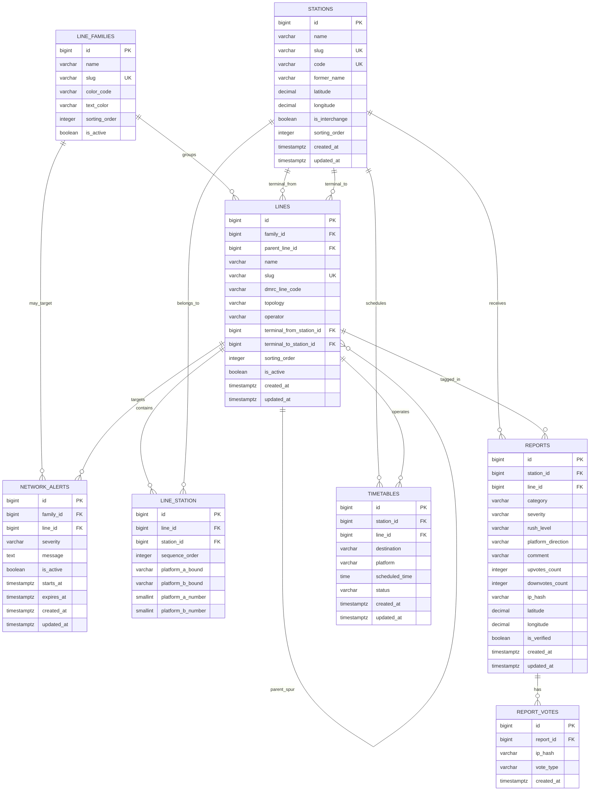

# Station Rush — Full Network Schema (archived)

This is the **corridor / loop / spur** PostgreSQL model. It is **not** what the app builds against.

Canonical product schema: [db-schema.md](db-schema.md).

---

This document locks in a full DMRC graph for **Station Rush** (crowdsourced transit intelligence) if you later need Line 3 vs Line 4, Pink as a ring, or Magenta as disconnected sections.

---

## 0. Network topology (why the line tables look like this)

DMRC is **not** “one colour = one corridor with two named ends.” The schema treats a **corridor** as a `lines` row, and a **colour on the map** as a `line_families` row.

| Reality (2026) | How we model it |
| :--- | :--- |
| Most corridors (Yellow, Red, Violet, Grey, Airport Express, Magenta Botanical Garden–Krishna Park, etc.) | One `lines` row, `topology = 'linear'`, two station FKs |
| Blue = DMRC Line 3 **and** Line 4 (fork at **Yamuna Bank**) | Two `lines` rows, same `family` (`blue`). Line 3: Dwarka Sector 21 ↔ Noida Electronic City. Line 4: Yamuna Bank ↔ Vaishali |
| Green = main + Kirti Nagar spur (split at **Ashok Park Main**) | Two `lines` rows, family `green` |
| Pink = **ring** (Majlis Park–Maujpur loop, operational 8 Mar 2026) + **Shiv Vihar spur** | Loop row (`topology = 'loop'`, termini NULL) + spur row (`topology = 'spur'`, Maujpur–Babarpur ↔ Shiv Vihar), same family `pink` |
| Magenta Phase IV: **Deepali Chowk–Majlis Park** is open but **not yet joined** to Krishna Park | Two `lines` rows, same family `magenta`, until the missing link opens (then merge sequences) |
| **Yamuna Bank** | Four platforms: P1 Noida, P3 Vaishali, P2 and P4 both Dwarka. Line 3 and Line 4 **each** get a `line_station` row with different numbers |
| **Rajiv Chowk / Mandi House** (Blue trunk west of the fork) | Line 3 **and** Line 4 share **the same posted numbers** (P3/P4). UI **merges** “Towards {terminal names}” for that platform number across the family |
| Kashmere Gate Violet P6 | `bound = 'terminating'` (arrival / trains terminate here) |
| Rapid Metro Gurugram | One linear corridor (Sector 55-56 ↔ DLF Phase 3) with a northern loop in the middle; two termini are enough for crowd reports |
| Aqua Line | NMRC, not DMRC; `operator = 'nmrc'` so we can include it without mixing operators |
| Home-screen chips | Group by **`line_families`**, not by every corridor row |

**Seed order:** `stations` → `line_families` → `lines` → `line_station`. Terminal FKs on `lines` require stations to exist first.

**UI / API:** never show A/B, `towards_from` / `towards_to`, clockwise, or family slugs. Show posted **platform number** + **Towards {station.name}** (or **Terminating**). For a loop, resolve bound to the **next station** (or next interchange) along `sequence_order`.

---

## 1. Entity-Relationship Overview

---

## 2. Table Definitions & Constraints

### 2.1 Table: `line_families`
One map colour / commuter name (Blue, Pink, Magenta). Home screen, branding, and “whole Blue Line down” alerts use this table — not every corridor.

| Column | Type | Constraints / Default | Description |
| :--- | :--- | :--- | :--- |
| `id` | `BIGSERIAL` | `PRIMARY KEY` | Unique family identifier |
| `name` | `VARCHAR(100)` | `NOT NULL` | Commuter name (e.g., `"Blue Line"`, `"Pink Line"`) |
| `slug` | `VARCHAR(100)` | `UNIQUE NOT NULL` | URL slug (e.g., `"blue-line"`), Indexed |
| `color_code` | `VARCHAR(7)` | `NOT NULL` | Primary hex (e.g., `"#0078C9"`) |
| `text_color` | `VARCHAR(7)` | `DEFAULT '#FFFFFF'` | Contrast hex |
| `sorting_order` | `INTEGER` | `DEFAULT 0` | Home-screen chip order |
| `is_active` | `BOOLEAN` | `DEFAULT true` | Hide an entire colour |
| `created_at` | `TIMESTAMPTZ` | `DEFAULT NOW()` | Record creation timestamp |
| `updated_at` | `TIMESTAMPTZ` | `DEFAULT NOW()` | Record update timestamp |

---

### 2.2 Table: `lines`
One **operational corridor** (DMRC Line 3 vs Line 4, Pink ring vs Pink spur). Terminal names are **not** stored here; they are `stations.name` via FKs.

| Column | Type | Constraints / Default | Description |
| :--- | :--- | :--- | :--- |
| `id` | `BIGSERIAL` | `PRIMARY KEY` | Unique corridor identifier |
| `family_id` | `BIGINT` | `NOT NULL`, `REFERENCES line_families(id) ON DELETE RESTRICT` | Map colour this corridor belongs to |
| `parent_line_id` | `BIGINT` | `NULL`, `REFERENCES lines(id) ON DELETE SET NULL` | Spur’s parent ring/main (Pink Shiv Vihar → Pink loop; Green Kirti Nagar → Green main). NULL for mains and sibling disconnected sections |
| `name` | `VARCHAR(120)` | `NOT NULL` | Corridor label (e.g., `"Blue Line (Noida)"`, `"Blue Line (Vaishali)"`, `"Pink Line (Loop)"`) |
| `slug` | `VARCHAR(120)` | `UNIQUE NOT NULL` | URL slug (e.g., `"blue-line-noida"`), Indexed |
| `dmrc_line_code` | `VARCHAR(20)` | `NULL` | Official code where it exists: `"1"`…`"9"`, `"4"` (Blue branch), `"AEL"` (Airport Express). Rapid / Aqua may be NULL |
| `topology` | `VARCHAR(20)` | `NOT NULL`, `CHECK IN ('linear', 'loop', 'spur')` | See section 0 |
| `operator` | `VARCHAR(20)` | `NOT NULL`, `DEFAULT 'dmrc'` | `'dmrc'`, `'nmrc'` (Aqua), `'rapid'` (Gurugram Rapid Metro) |
| `terminal_from_station_id` | `BIGINT` | `NULL`, `REFERENCES stations(id) ON DELETE RESTRICT` | Origin terminus. **Required** for `linear` and `spur`. **NULL** for `loop` |
| `terminal_to_station_id` | `BIGINT` | `NULL`, `REFERENCES stations(id) ON DELETE RESTRICT` | Destination terminus. **Required** for `linear` and `spur`. **NULL** for `loop` |
| `sorting_order` | `INTEGER` | `DEFAULT 0` | Order within a family (main before branch) |
| `is_active` | `BOOLEAN` | `DEFAULT true` | Corridor operational status |
| `created_at` | `TIMESTAMPTZ` | `DEFAULT NOW()` | Record creation timestamp |
| `updated_at` | `TIMESTAMPTZ` | `DEFAULT NOW()` | Record update timestamp |

**Checks:**
* `linear` / `spur`: both terminal FKs `NOT NULL` and `terminal_from_station_id <> terminal_to_station_id`
* `loop`: both terminal FKs `NULL`
* `spur`: `parent_line_id IS NOT NULL`

**Display:** `'towards_from'` → `stations.name` of `terminal_from_station_id`; `'towards_to'` → `terminal_to_station_id`.

**Shared-trunk merge:** at a station, if two corridors in the **same family** reuse the same `platform_*_number`, concatenate distinct towards-names (Rajiv Chowk P3 → Noida Electronic City / Vaishali).

---

### 2.3 Table: `stations`
Physical stations. One row per paid-area / DMRC station object (Rajiv Chowk once, even though it has four platforms).

| Column | Type | Constraints / Default | Description |
| :--- | :--- | :--- | :--- |
| `id` | `BIGSERIAL` | `PRIMARY KEY` | Unique station identifier |
| `name` | `VARCHAR(150)` | `NOT NULL` | Current public name (e.g., `"Rajiv Chowk"`, `"Madhuban Chowk"`) |
| `slug` | `VARCHAR(150)` | `UNIQUE NOT NULL` | URL slug (e.g., `"rajiv-chowk"`), Indexed |
| `code` | `VARCHAR(16)` | `NULL`, `UNIQUE` | Official station code (e.g., `"RCK"`, `"KG"`). UNIQUE so codes stay 1:1 with a station |
| `former_name` | `VARCHAR(150)` | `NULL` | Previous public name for search (e.g., Pitampura → Madhuban Chowk, HUDA City Centre → Millennium City Centre Gurugram) |
| `latitude` | `NUMERIC(10, 7)` | `NULL` | Station GPS latitude (geo-fencing) |
| `longitude` | `NUMERIC(10, 7)` | `NULL` | Station GPS longitude (geo-fencing) |
| `is_interchange` | `BOOLEAN` | `DEFAULT false` | Metro-to-metro junction (2+ rows in `line_station`, or a family-internal fork like Yamuna Bank). Keep in sync when seeding |
| `sorting_order` | `INTEGER` | `DEFAULT 0` | Alphabetical / directory index |
| `created_at` | `TIMESTAMPTZ` | `DEFAULT NOW()` | Record creation timestamp |
| `updated_at` | `TIMESTAMPTZ` | `DEFAULT NOW()` | Record update timestamp |

Junctions that sit on **two corridors of the same colour** still get two `line_station` rows (Yamuna Bank, Ashok Park Main, Maujpur-Babarpur). That is how fork platforms stay distinct.

---

### 2.4 Table: `line_station` (Pivot Table for Many-to-Many)
Line-specific sequence, two faces (A/B, **internal only**), posted platform numbers, and which **bound** each face is.

Platform numbers are **station-wide**, not 1/2 per line (Rajiv Chowk Yellow P1–P2, Blue P3–P4; Kashmere Gate Yellow P1–P2, Red P3–P4, Violet P5–P6; Mandi House Blue P1–P2, Violet P3–P4).

| Column | Type | Constraints / Default | Description |
| :--- | :--- | :--- | :--- |
| `id` | `BIGSERIAL` | `PRIMARY KEY` | Unique pivot record ID |
| `line_id` | `BIGINT` | `REFERENCES lines(id) ON DELETE CASCADE` | Corridor |
| `station_id` | `BIGINT` | `REFERENCES stations(id) ON DELETE CASCADE` | Station |
| `sequence_order` | `INTEGER` | `NOT NULL` | Order along this corridor. On a **loop**, 1…N around the ring (no wrap stored; app treats N as adjacent to 1) |
| `platform_a_bound` | `VARCHAR(20)` | `NULL`, `CHECK IN ('towards_from', 'towards_to', 'clockwise', 'anticlockwise', 'terminating')` | Internal face A |
| `platform_b_bound` | `VARCHAR(20)` | `NULL`, `CHECK IN ('towards_from', 'towards_to', 'clockwise', 'anticlockwise', 'terminating')` | Internal face B |
| `platform_a_number` | `SMALLINT` | `NULL` | Posted number for face A |
| `platform_b_number` | `SMALLINT` | `NULL` | Posted number for face B |

**Bound vs topology:**
* `linear` / `spur`: `'towards_from'` \| `'towards_to'` (and `'terminating'` on a dead-end face)
* `loop`: `'clockwise'` \| `'anticlockwise'` — copy is the next station along that rotation, **not** a terminus name

**Examples:**
* Rajiv Chowk Yellow: A = `1` + `towards_to` (Gurugram), B = `2` + `towards_from` (Samaypur Badli)
* Rajiv Chowk Blue Line 3 **and** Line 4: both A = `3` + `towards_to`, B = `4` + `towards_from` (merge names in UI)
* Yamuna Bank Line 3: A = `1` Noida (`towards_to`), B = `2` Dwarka (`towards_from`)
* Yamuna Bank Line 4: A = `3` Vaishali (`towards_to`), B = `4` Dwarka (`towards_from`)
* Kashmere Gate Violet: A = `5` + `towards_to` (Raja Nahar Singh), B = `6` + `terminating`

**Composite Constraints & Indexes:**
* `UNIQUE (line_id, station_id)`
* `UNIQUE (line_id, sequence_order)` — one slot per stop on a corridor
* `CHECK (platform_a_bound IS DISTINCT FROM platform_b_bound)` — when both faces are set
* `INDEX (station_id)` — all corridors at a station

---

### 2.5 Table: `reports`
Crowdsourced crowd and delay observations submitted via the 2-tap report modal.

| Column | Type | Constraints / Default | Description |
| :--- | :--- | :--- | :--- |
| `id` | `BIGSERIAL` | `PRIMARY KEY` | Unique report identifier |
| `station_id` | `BIGINT` | `REFERENCES stations(id) ON DELETE CASCADE`, `INDEX` | Station where report was logged |
| `line_id` | `BIGINT` | `NULL`, `REFERENCES lines(id) ON DELETE SET NULL` | Optional **corridor** (Line 3 vs Line 4). Prefer setting this at interchanges |
| `category` | `VARCHAR(50)` | `NOT NULL` | `'Crowd Surge'`, `'Train Delay'`, `'Security'`, `'Gate Closed'` |
| `severity` | `VARCHAR(20)` | `NOT NULL` | `'Minor'`, `'Moderate'`, `'Severe'` |
| `rush_level` | `VARCHAR(20)` | `NOT NULL`, `INDEX` | Standard metric: `'low'`, `'normal'`, `'heavy'` |
| `platform_direction` | `VARCHAR(20)` | `DEFAULT 'both'` | Internal: `'platform_a'`, `'platform_b'`, `'both'`. Resolve number + bound via `line_station`. Never expose A/B in the UI |
| `comment` | `VARCHAR(140)` | `NULL` | Optional commuter note (max 140 chars) |
| `upvotes_count` | `INTEGER` | `DEFAULT 1` | Denormalized count of "Agree" upvotes |
| `downvotes_count` | `INTEGER` | `DEFAULT 0` | Denormalized count of "Disagree / Cleared" votes |
| `ip_hash` | `VARCHAR(64)` | `NOT NULL`, `INDEX` | SHA-256 hash of (IP + User Agent) for rate limiting |
| `latitude` | `NUMERIC(10, 7)` | `NULL` | GPS latitude at submission |
| `longitude` | `NUMERIC(10, 7)` | `NULL` | GPS longitude at submission |
| `is_verified` | `BOOLEAN` | `DEFAULT false` | True if commuter was within 500m radius of station |
| `created_at` | `TIMESTAMPTZ` | `DEFAULT NOW()`, `INDEX` | Timestamp for time-weighted exponential decay |
| `updated_at` | `TIMESTAMPTZ` | `DEFAULT NOW()` | Record update timestamp |

**Indexes:**
* `INDEX (station_id, created_at DESC)` — Primary index for fast time-decay aggregation.
* `INDEX (ip_hash, station_id, created_at DESC)` — For 3-minute rate limiting check.

---

### 2.6 Table: `report_votes`
Tracks community verification votes (Agree, Disagree, Cleared) per device hash to prevent vote manipulation.

| Column | Type | Constraints / Default | Description |
| :--- | :--- | :--- | :--- |
| `id` | `BIGSERIAL` | `PRIMARY KEY` | Unique vote record ID |
| `report_id` | `BIGINT` | `REFERENCES reports(id) ON DELETE CASCADE`, `INDEX` | Target crowd report |
| `ip_hash` | `VARCHAR(64)` | `NOT NULL`, `INDEX` | SHA-256 device hash |
| `vote_type` | `VARCHAR(20)` | `DEFAULT 'agree'` | Vote type: `'agree'`, `'disagree'`, `'cleared'` |
| `created_at` | `TIMESTAMPTZ` | `DEFAULT NOW()` | Vote timestamp |

**Composite Constraints:**
* `UNIQUE (report_id, ip_hash)` — Enforces exactly 1 vote per commuter per report (can change vote type from agree to disagree, but not multi-vote).

---

### 2.7 Table: `network_alerts`
Network-wide, colour-wide, or corridor-specific disruption notices.

| Column | Type | Constraints / Default | Description |
| :--- | :--- | :--- | :--- |
| `id` | `BIGSERIAL` | `PRIMARY KEY` | Unique alert ID |
| `family_id` | `BIGINT` | `NULL`, `REFERENCES line_families(id) ON DELETE CASCADE` | Whole colour (e.g. all Blue corridors). NULL if not family-scoped |
| `line_id` | `BIGINT` | `NULL`, `REFERENCES lines(id) ON DELETE CASCADE` | Single corridor. NULL if not corridor-scoped |
| `severity` | `VARCHAR(20)` | `DEFAULT 'warning'` | `'info'`, `'warning'`, `'critical'` |
| `message` | `TEXT` | `NOT NULL` | Alert text displayed in banner |
| `is_active` | `BOOLEAN` | `DEFAULT true`, `INDEX` | Active banner toggle |
| `starts_at` | `TIMESTAMPTZ` | `NULL` | Effective start time |
| `expires_at` | `TIMESTAMPTZ` | `NULL` | Expiration time |
| `created_at` | `TIMESTAMPTZ` | `DEFAULT NOW()` | Creation timestamp |
| `updated_at` | `TIMESTAMPTZ` | `DEFAULT NOW()` | Update timestamp |

Both `family_id` and `line_id` NULL = entire network. Prefer `family_id` for “Blue Line suspended,” `line_id` for “Vaishali branch only.”

---

### 2.8 Table: `timetables`
Scheduled baseline arrivals for station timetable widget.

| Column | Type | Constraints / Default | Description |
| :--- | :--- | :--- | :--- |
| `id` | `BIGSERIAL` | `PRIMARY KEY` | Unique timetable ID |
| `station_id` | `BIGINT` | `REFERENCES stations(id) ON DELETE CASCADE`, `INDEX` | Target station |
| `line_id` | `BIGINT` | `REFERENCES lines(id) ON DELETE CASCADE` | Operating **corridor** (Noida vs Vaishali train) |
| `destination` | `VARCHAR(150)` | `NOT NULL` | This train’s terminus name (may copy `stations.name` of that trip’s end) |
| `platform` | `VARCHAR(20)` | `NOT NULL` | Posted station signage (e.g., `"P1"`, `"P3"`), not internal A/B |
| `scheduled_time` | `TIME` | `NOT NULL` | Train scheduled departure time |
| `status` | `VARCHAR(20)` | `DEFAULT 'On Time'` | `'On Time'`, `'Delayed'` |
| `created_at` | `TIMESTAMPTZ` | `DEFAULT NOW()` | Creation timestamp |
| `updated_at` | `TIMESTAMPTZ` | `DEFAULT NOW()` | Update timestamp |

---

## 3. Real-Time Scoring & Decay Formula (With Downvote Penalty)

When calculating the live rush gauge for a station:
$$\text{Score} = \sum_{i=1}^{n} w(\text{severity}_i) \cdot \max\left(0, 1 + 0.2 \cdot (\text{upvotes}_i - 1) - 0.5 \cdot \text{downvotes}_i\right) \cdot e^{-\lambda t_i}$$

* $w(\text{Minor}) = 1.0$, $w(\text{Moderate}) = 2.0$, $w(\text{Severe}) = 3.5$
* $\lambda = \frac{\ln 2}{15 \text{ mins}}$ (Half-life of 15 minutes)
* If $\text{downvotes}_i > \text{upvotes}_i \times 2$, the report is automatically suppressed / flagged as false.
* $\text{Score} < 3.0 \rightarrow \mathbf{Low\ Rush}$
* $3.0 \le \text{Score} < 8.0 \rightarrow \mathbf{Normal\ Rush}$
* $\text{Score} \ge 8.0 \rightarrow \mathbf{Heavy\ Rush}$
