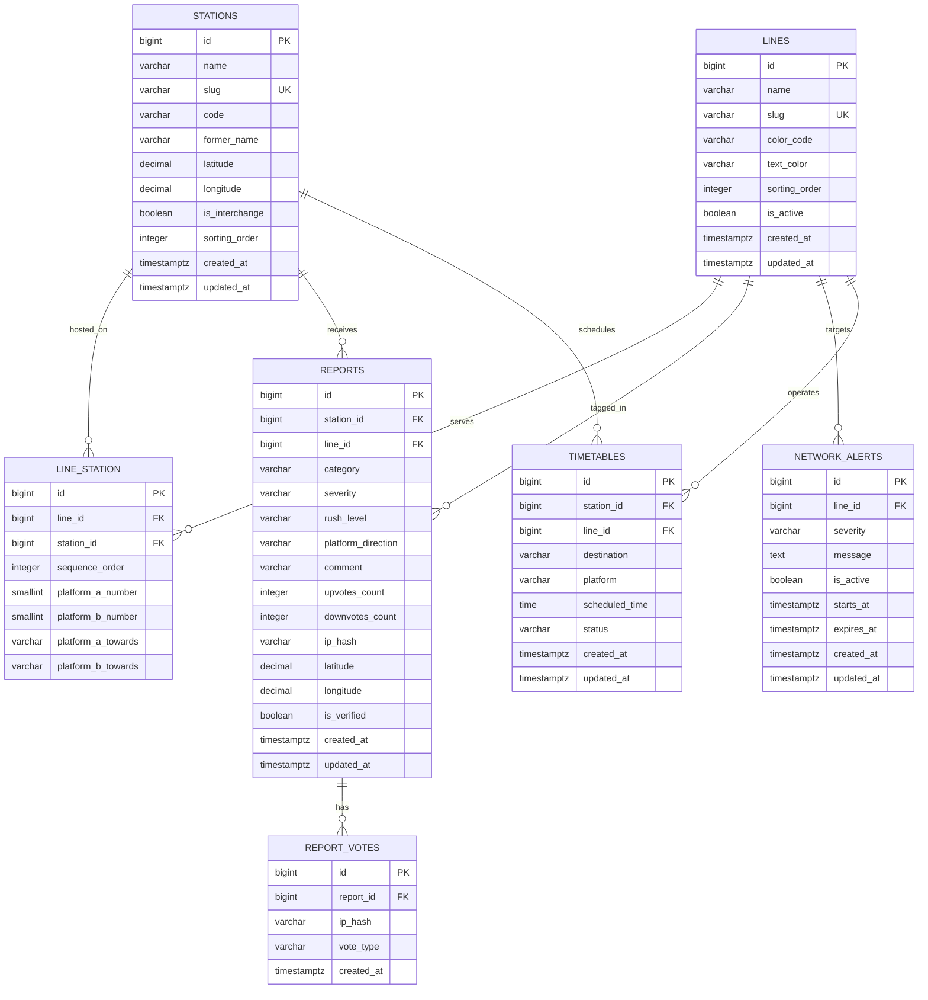

# Station Rush — Database Schema Specification

Canonical **product-sized** PostgreSQL schema: enough to pick a station, tag a map colour, report rush, and show a gauge.

It is **not** a DMRC network graph. The corridor/loop/spur model is archived in [db-schema-full.md](db-schema-full.md) if you later need Line 3 vs Line 4 as separate rows.

**In scope:** stations, colours, “this colour stops here”, optional platform numbers + towards labels, reports, votes, alerts, a simple timetable widget.

**Out of scope:** `line_families`, parent corridors, `topology`, operators, clockwise/anticlockwise, terminating bounds, DMRC line codes, shared-trunk merge rules.

---

## 0. Product rules

- Rush score is **per station** (see section 3). A colour on a report is optional context, not a second graph.
- One `lines` row = one **map colour** commuters tap (Blue, Yellow, Pink). Blue’s fork is a towards-label (`"Noida Electronic City / Vaishali"`), not two line rows.
- Platform **A/B** are internal only. UI shows `Platform {n} · Towards {label}` (or “both”).
- Towards labels live on `line_station` as short signage strings. Duplicating “Samaypur Badli” on many Yellow rows is cheaper than modeling the whole network. Rename a terminus in seed data / a one-off SQL update.
- Seed only what the UI lists. You do not need every Rapid Metro / Aqua station on day one.

---

## 1. Entity-Relationship Overview

---

## 2. Table Definitions & Constraints

### 2.1 Table: `lines`
Map colours. Not DMRC Line 3 vs Line 4.

| Column | Type | Constraints / Default | Description |
| :--- | :--- | :--- | :--- |
| `id` | `BIGSERIAL` | `PRIMARY KEY` | Unique line identifier |
| `name` | `VARCHAR(100)` | `NOT NULL` | `"Yellow Line"`, `"Blue Line"` |
| `slug` | `VARCHAR(100)` | `UNIQUE NOT NULL` | `"yellow-line"`, Indexed |
| `color_code` | `VARCHAR(7)` | `NOT NULL` | Hex, e.g. `"#F5C518"` |
| `text_color` | `VARCHAR(7)` | `DEFAULT '#FFFFFF'` | Contrast hex |
| `sorting_order` | `INTEGER` | `DEFAULT 0` | Home-screen chip order |
| `is_active` | `BOOLEAN` | `DEFAULT true` | Hide a colour |
| `created_at` | `TIMESTAMPTZ` | `DEFAULT NOW()` | Created |
| `updated_at` | `TIMESTAMPTZ` | `DEFAULT NOW()` | Updated |

No terminal columns. Ends of a colour are implied by towards-labels on stations (or omitted until you need them).

---

### 2.2 Table: `stations`
Places people stand and report from. One row per station (Rajiv Chowk once).

| Column | Type | Constraints / Default | Description |
| :--- | :--- | :--- | :--- |
| `id` | `BIGSERIAL` | `PRIMARY KEY` | Unique station identifier |
| `name` | `VARCHAR(150)` | `NOT NULL` | `"Rajiv Chowk"` |
| `slug` | `VARCHAR(150)` | `UNIQUE NOT NULL` | `"rajiv-chowk"`, Indexed |
| `code` | `VARCHAR(16)` | `NULL`, `INDEX` | Official code if you have it (`"RCK"`, `"KG"`). Not required to launch |
| `former_name` | `VARCHAR(150)` | `NULL` | Search alias (Pitampura, HUDA City Centre) |
| `latitude` | `NUMERIC(10, 7)` | `NULL` | Geo-fence |
| `longitude` | `NUMERIC(10, 7)` | `NULL` | Geo-fence |
| `is_interchange` | `BOOLEAN` | `DEFAULT false` | Multi-colour station; set when seeding |
| `sorting_order` | `INTEGER` | `DEFAULT 0` | Directory order |
| `created_at` | `TIMESTAMPTZ` | `DEFAULT NOW()` | Created |
| `updated_at` | `TIMESTAMPTZ` | `DEFAULT NOW()` | Updated |

---

### 2.3 Table: `line_station`
“This colour stops at this station.” Optional posted numbers and towards copy for the report modal.

Platform numbers are **station-wide** (Rajiv Chowk Yellow P1/P2, Blue P3/P4). Leave numbers/towards `NULL` if you only need “Yellow stops here.”

| Column | Type | Constraints / Default | Description |
| :--- | :--- | :--- | :--- |
| `id` | `BIGSERIAL` | `PRIMARY KEY` | Pivot id |
| `line_id` | `BIGINT` | `REFERENCES lines(id) ON DELETE CASCADE` | Colour |
| `station_id` | `BIGINT` | `REFERENCES stations(id) ON DELETE CASCADE` | Station |
| `sequence_order` | `INTEGER` | `DEFAULT 0` | Optional order on a colour’s station list (home/line page). Not used for routing |
| `platform_a_number` | `SMALLINT` | `NULL` | Posted number, internal face A |
| `platform_b_number` | `SMALLINT` | `NULL` | Posted number, internal face B |
| `platform_a_towards` | `VARCHAR(150)` | `NULL` | Signage for A, e.g. `"Millennium City Centre Gurugram"` |
| `platform_b_towards` | `VARCHAR(150)` | `NULL` | Signage for B, e.g. `"Samaypur Badli"` |

**Examples (only if you seed platforms):**
- Rajiv Chowk × Yellow: A `1` / Gurugram, B `2` / Samaypur Badli
- Rajiv Chowk × Blue: A `3` / `"Noida Electronic City / Vaishali"`, B `4` / `"Dwarka Sector 21"`
- Yamuna Bank × Blue: you can still use **one** Blue row; put the most useful pair on the pivot, or skip numbers and let people report “Blue · both”

**Constraints & indexes:**
* `UNIQUE (line_id, station_id)`
* `INDEX (line_id, sequence_order)`
* `INDEX (station_id)`

A/B are never shown. Compose: `"Platform 3 · Towards Noida Electronic City / Vaishali"`.

---

### 2.4 Table: `reports`
2-tap crowd / delay reports.

| Column | Type | Constraints / Default | Description |
| :--- | :--- | :--- | :--- |
| `id` | `BIGSERIAL` | `PRIMARY KEY` | Report id |
| `station_id` | `BIGINT` | `REFERENCES stations(id) ON DELETE CASCADE`, `INDEX` | Where it was logged |
| `line_id` | `BIGINT` | `NULL`, `REFERENCES lines(id) ON DELETE SET NULL` | Optional colour |
| `category` | `VARCHAR(50)` | `NOT NULL` | `'Crowd Surge'`, `'Train Delay'`, `'Security'`, `'Gate Closed'` |
| `severity` | `VARCHAR(20)` | `NOT NULL` | `'Minor'`, `'Moderate'`, `'Severe'` |
| `rush_level` | `VARCHAR(20)` | `NOT NULL`, `INDEX` | `'low'`, `'normal'`, `'heavy'` |
| `platform_direction` | `VARCHAR(20)` | `DEFAULT 'both'` | Internal `'platform_a'`, `'platform_b'`, `'both'` |
| `comment` | `VARCHAR(140)` | `NULL` | Optional note |
| `upvotes_count` | `INTEGER` | `DEFAULT 1` | Agree count |
| `downvotes_count` | `INTEGER` | `DEFAULT 0` | Disagree / cleared |
| `ip_hash` | `VARCHAR(64)` | `NOT NULL`, `INDEX` | SHA-256(IP + UA) |
| `latitude` | `NUMERIC(10, 7)` | `NULL` | Submit GPS |
| `longitude` | `NUMERIC(10, 7)` | `NULL` | Submit GPS |
| `is_verified` | `BOOLEAN` | `DEFAULT false` | Within 500m of station |
| `created_at` | `TIMESTAMPTZ` | `DEFAULT NOW()`, `INDEX` | Decay timestamp |
| `updated_at` | `TIMESTAMPTZ` | `DEFAULT NOW()` | Updated |

**Indexes:**
* `INDEX (station_id, created_at DESC)` — time-decay aggregation
* `INDEX (ip_hash, station_id, created_at DESC)` — 3-minute rate limit

---

### 2.5 Table: `report_votes`

| Column | Type | Constraints / Default | Description |
| :--- | :--- | :--- | :--- |
| `id` | `BIGSERIAL` | `PRIMARY KEY` | Vote id |
| `report_id` | `BIGINT` | `REFERENCES reports(id) ON DELETE CASCADE`, `INDEX` | Report |
| `ip_hash` | `VARCHAR(64)` | `NOT NULL`, `INDEX` | Device hash |
| `vote_type` | `VARCHAR(20)` | `DEFAULT 'agree'` | `'agree'`, `'disagree'`, `'cleared'` |
| `created_at` | `TIMESTAMPTZ` | `DEFAULT NOW()` | Voted at |

* `UNIQUE (report_id, ip_hash)` — one vote per device per report (type may change)

---

### 2.6 Table: `network_alerts`

| Column | Type | Constraints / Default | Description |
| :--- | :--- | :--- | :--- |
| `id` | `BIGSERIAL` | `PRIMARY KEY` | Alert id |
| `line_id` | `BIGINT` | `NULL`, `REFERENCES lines(id) ON DELETE CASCADE` | Colour banner; `NULL` = whole network |
| `severity` | `VARCHAR(20)` | `DEFAULT 'warning'` | `'info'`, `'warning'`, `'critical'` |
| `message` | `TEXT` | `NOT NULL` | Banner text |
| `is_active` | `BOOLEAN` | `DEFAULT true`, `INDEX` | Toggle |
| `starts_at` | `TIMESTAMPTZ` | `NULL` | Start |
| `expires_at` | `TIMESTAMPTZ` | `NULL` | End |
| `created_at` | `TIMESTAMPTZ` | `DEFAULT NOW()` | Created |
| `updated_at` | `TIMESTAMPTZ` | `DEFAULT NOW()` | Updated |

---

### 2.7 Table: `timetables`
Optional widget. Not live DMRC timings. Skip seeding until you need the UI.

| Column | Type | Constraints / Default | Description |
| :--- | :--- | :--- | :--- |
| `id` | `BIGSERIAL` | `PRIMARY KEY` | Row id |
| `station_id` | `BIGINT` | `REFERENCES stations(id) ON DELETE CASCADE`, `INDEX` | Station |
| `line_id` | `BIGINT` | `REFERENCES lines(id) ON DELETE CASCADE` | Colour |
| `destination` | `VARCHAR(150)` | `NOT NULL` | `"Vaishali"`, `"Noida Electronic City"` |
| `platform` | `VARCHAR(20)` | `NOT NULL` | Posted `"P1"`, `"P3"` |
| `scheduled_time` | `TIME` | `NOT NULL` | Scheduled time |
| `status` | `VARCHAR(20)` | `DEFAULT 'On Time'` | `'On Time'`, `'Delayed'` |
| `created_at` | `TIMESTAMPTZ` | `DEFAULT NOW()` | Created |
| `updated_at` | `TIMESTAMPTZ` | `DEFAULT NOW()` | Updated |

---

## 3. Real-Time Scoring & Decay Formula (With Downvote Penalty)

Gauge is **station-level**.

$$\text{Score} = \sum_{i=1}^{n} w(\text{severity}_i) \cdot \max\left(0, 1 + 0.2 \cdot (\text{upvotes}_i - 1) - 0.5 \cdot \text{downvotes}_i\right) \cdot e^{-\lambda t_i}$$

* $w(\text{Minor}) = 1.0$, $w(\text{Moderate}) = 2.0$, $w(\text{Severe}) = 3.5$
* $\lambda = \frac{\ln 2}{15 \text{ mins}}$ (half-life 15 minutes)
* If $\text{downvotes}_i > \text{upvotes}_i \times 2$, suppress the report
* $\text{Score} < 3.0 \rightarrow$ Low Rush
* $3.0 \le \text{Score} < 8.0 \rightarrow$ Normal Rush
* $\text{Score} \ge 8.0 \rightarrow$ Heavy Rush

---

## 4. What this deliberately cannot do

- Tell Line 3 apart from Line 4 in the database (both are Blue)
- Walk a Pink loop clockwise
- Know Magenta is two disconnected sections
- Guarantee towards-labels stay in sync with `stations.name` on a rename

Add those only if the product grows a line map or per-branch gauges; then graduate to [db-schema-full.md](db-schema-full.md).
